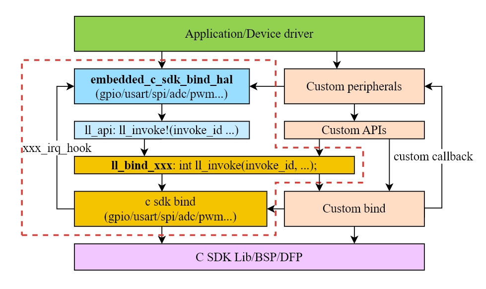

# Rust HAL with C SDK Framework

## Introduction
This is a Rust HAL  framework to be bound to the MCU C SDK/BSP.

Ownership restrictions friendly, almost all types can be Copy/Clone.

## Description
### Startup and runtime
 - Use cortexm-rt or riscv-rt directly, referring to the implementation of **_ll_bind_hk32F0301mxxc_**
 - Use the SDK/BSP startup_XXX.S, refer to the implementation of **_ll_bind_ch32v20x_**

### Interrupt
 - Can be fully implemented in C to facilitate the clear of interrupt flags
 - Handle HAL or application data via rust-defined hook callback function

### HAL hook
 - EXTI: **fn EXTI_IRQ_hook_rs(line: u8)**, refer to **_[ll_bind_hk32F0301mxxc/csrc/interrupt.c](ll_bind_hk32F0301mxxc/csrc/interrupt.c)_** 
 - ADC: **fn ADC_CH{ch}_EOC_hook_rs(val:AdcDataType)**, refer to **_[ll_bind_ch32v20x/csrc/adc.c](ll_bind_ch32v20x/csrc/adc.c)_** 
 - USART: **fn USART{id}_rx_hook_rs(val: u8)**, refer to **_[ll_bind_ch32v20x/csrc/usart.c](ll_bind_ch32v20x/csrc/usart.c)_** 
 - Tick: **fn sys_tick_inc()**, reference **_[ll_bind_ch32v20x/csrc/ll_api.c](ll_bind_ch32v20x/csrc/ll_api.c)_** and **_[example_hk32/src/interrupt.rs](example_hk32/src/interrupt.rs)_**  

### Features
 - **print-log** = []: print!,println! print logs via serial port
 - **tick-size-64bit** = []: The tick counter uses 64 bits, default is 32 bits
 - **Embassy** = []: Embassy timer driver and GPIO input asynchronous support
 - **USART-[0..7]** = []: Serial port receive cache and callback ID definition
 - **adc-data-type-u8** = [] : Use 8-bit ADC data type, 16-bit by default
 - **adc-buffered-ch[0..7]** = []: ADC cache and callback definitions
 - **exti-irq-callback** = [] : exti interrupt callback, which needs to be defined by the App
 - **print-log-csdk** = ["print-log"]： print!, println! use formatting function from CSDK to output logs, Save 2-6KB, refer to [example_ch32v/examples/print.rs](example_ch32v/examples/print.rs)

### print-log-csdk print log limits
 - Add %S and %y lable to format strings and arrays with length parameters, refer to **_ll_bind_ch32v20x\csrc\print.c_**
 - Not support padding

### [CHANGELOG](embedded_c_sdk_bind_hal/CHANGELOG.md)

### Architecture
---

